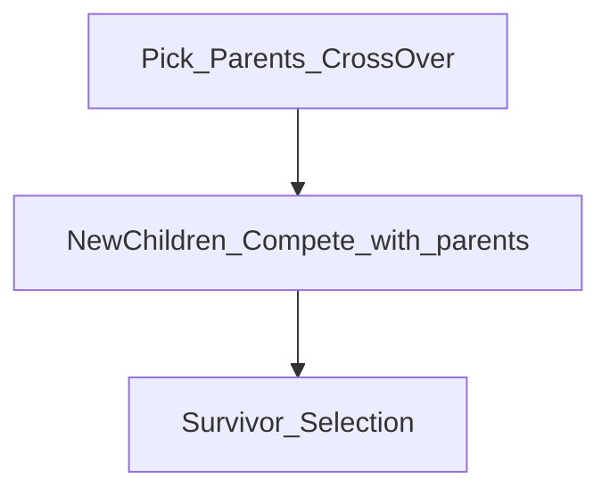

# To do list
# Excecuting the file

```
    python ev2.py -i ev2.cfg
```
## To enable self adpative do the following
1. Remove mutationProb and mutationStddev, they are no longer needed, since a sigma would be added to each individual

2. The mutation step is determined by $\sigma$, and $\sigma$ would get carried and changed in each mutation for each individual.

3. Individual shall be modified to have
* self-adaptive varaible $\sigma$
* crossover(self,other) -> return new individual
* mutate(self) the internal state mutation
* crossOver operator uses stohastic arithmetic crossover.



## Mutation
1. Pick two parents and then with crossover producing new children and mutate them repetitively for 5 times.

2. Compete these new children with their parents.

3. Survivor selection: replace the worst inside population,
    killing worst child and parents after each child birth.

## Replace-Worst Selection
4. Repeat 5 times s.t. all 5 children generated can competed with their parents and replace them if needed.

# Testing.
1. Uses Parabola and Rastrigin function for test.
2. During testing, some problem occurs, type error of numpy array to normal float64

# Question
1. How to do the debug while using config file? It would become harder to trace the code as program becomes larger