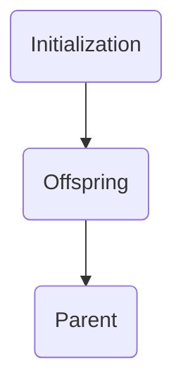
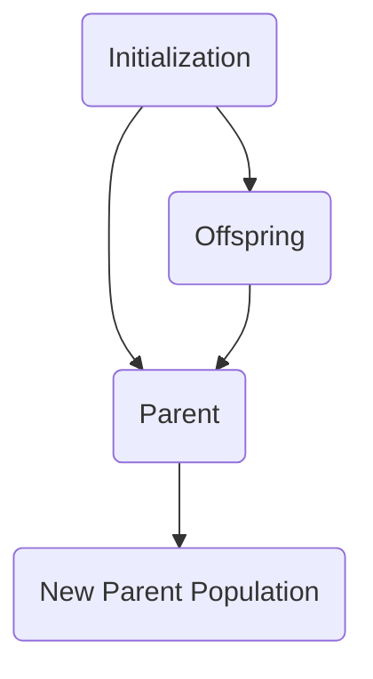

# Notes and To do list

# Population Management Terminology
- In EC systems we usually manage two primary population, parent population and offspring population

- $\mu$ : The general population size
- $\lambda$ : The offsptring population size

## Two models are usually used
- ($\mu$,$\lambda$): Survivor only chosen from offspring pop ($\lambda$)

- ($\mu + \lambda$): Variants where survivors chosen from COMBINED parent & offspring pops

# ($\mu$,$\lambda$)

# ($\mu + \lambda$)

# Tournament Selection

1. Pick k members at random from pop then select the best of these

2. Conduct a tournament among these k members, best one survives.

3. Repeat selecting from pop

# Binary Tournament Selection

0. Given $N$ pop, $S$ Generations, $F$ fit range, $P$ pop list with $N$ fitness values within fit range $F$

1. Dragging out pairs randomly with Uniform probabilty for competetion creating compete pairs $C$ of size $N/2$.

2. Conduct binary tournament first by competing in pairs of fitness value in $C$. The one with lower fitness wins creating $R$ competed result of size $N/2$.

3. Then perform the mating to generate children from $R$ until $N$ pop cap.

4. Repeats until $S$ generation
