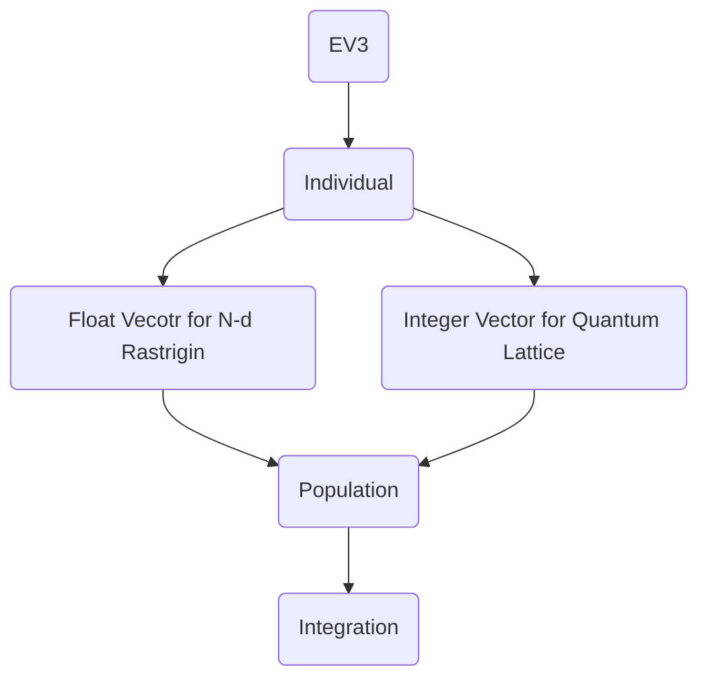

# Course note.
## Index
- [Course note.](#course-note)
  - [Index](#index)
  - [To run Problem 1](#to-run-problem-1)
  - [To run Problem 2 MIN](#to-run-problem-2-min)
  - [To run Problem 2 MAX](#to-run-problem-2-max)
- [Code architecture and testing](#code-architecture-and-testing)
  - [What shall be tested?](#what-shall-be-tested)
  - [Diversity in individuals](#diversity-in-individuals)
  - [Questions when programming](#questions-when-programming)
- [Improved EV3 in solving Combinatorial energy minimization problem.](#improved-ev3-in-solving-combinatorial-energy-minimization-problem)
  - [Introduction & Goals](#introduction--goals)
  - [Problem1](#problem1)
    - [Procedures](#procedures)
  - [Problem 2](#problem-2)
    - [Procedures](#procedures-1)
- [Final integrated EV3](#final-integrated-ev3)

## To run Problem 1
At directory $src/Final$ type the following
```
   python ev3.py -i problem1.cfg

```

## To run Problem 2 MIN
```
   python ev3.py -i problem2_MIN.cfg

```

## To run Problem 2 MAX
```
   python ev3.py -i problem2_MAX.cfg

```

# Code architecture and testing
- Testing and data reading and writing in a seperate way s.t. it can be flexible.
- Structuring the code would make the task easier and make testing easier later.

## What shall be tested?
1. Code itself
2. Algorithm correctness.
3. Perform comparative testing. Is the implementation better/worse than others?

## Diversity in individuals
1. Make more individual class
2. Or using isomorphism or class variations.
3. Add interface and use derived classes from individuals, from top level program we can treat these individuals all the same. Add methods into them, the mutation and crossOver methods.
4. These individuals classes has similar types, but might be with different data type which makes code more maintatinable and more extensible. Harvest the power of OOP.

5. You need to make sure that the quality of your code is fine. Proper result and comparison is needed!

6. Check for consistency, give more test patterns.

## Questions when programming
0. What is your way of prototyping a certain algorithm? How do you set up those varaibles needed? Procedures of testing when you are working your way through the algorithm? Can you give a demostration of your workflow?

1. How do you know which part of code needed to be modularized? Are there any general rules to follow? Any reference or textbook to follow? Design pattern approach?

2. How do you test a complex code? Printing out or are there other convenient stuff?
A:

4. How to debug a program from command pallette? Are there any tutorial of using parser any tutorial about it?
A:

5. Since most of the time spent on researching is reading other people's work. How to approach a new algorithm an algorithm you have never seen before?
A:

6. How to find the hyperparameter used in an EA algorithm?

# Improved EV3 in solving Combinatorial energy minimization problem.

## Introduction & Goals
>Goal: Find the arrangement using Improved EV3 algorithm s.t. the total energy of this arrangement shall be minimal. We only need to consider the interaction between the closest 2 particles.

1. Problem #1:
   - Add Combinatorial Integer representation type to EV3
   - Solve Imaginary 1-D universe energy minimization problem

2. Problem #2:
   - Upgrade EV3 real-number representation to handle multivariate problems, meaning that representation must handle problems with more than one variables(Requring a number of vectors)

   - Demonstrate by optimizaing given 2-D multi-dimensional Rastrigrin function.

3. For Problem #1
   1. Finite 1D discrete lattice with 3 types of particles
      - Lattice length is N
      - 3 particles types: Red Blue and Green(label as 0,1,2)
   2. Every point on the lattice has exactly 1 particle
      - No empty lattice sites
      - Never more than  one particle on a site
   3. Particles have self-energies and interaction energies ,and a known total enery function

## Problem1
- Minimize the total energy of given lattice of length N by choosing assignment of particle types on lattice.
- In the energy function calculation, we only need to consider the energy interaction i.u. adjacent to each particles. Distance more than 1 does not need to be considered.
- Use Self-adaptive mutation rate.
- Use combinatorial integer representation(vectors of integers)
- Following input parameters are needed.
   - selfEnergVector: [](LIST OF M, M is number of particles types)
   - interactionEnergyMatrix:$[[.],[.],[.]]$
   - latticeLength: N (an int, N is the length of 1-D lattice)
   - numParticleType: M(an int,where M is the number of particle types)

- Test with $N = 11, u=[1,2,3] t = [[10,4,1],[4,10,5],[1,5,10]]$
### Procedures
0. Read in self Energy Vector $u$, interaction Energy Matrix $t$, latticeLength $N$, ParticleTypes $M$, Learning Rate as $L$, Pop Size as $P$

1. Create POPSIZE $P$ numbers of lattices from ParticleTypes $M$ and latticeLength $N$, each with its length $N$ and Random vector representation by shuffling.
   - Each position of the vector representation is positioned with randomly chosen quantum type from $M$ types of particles. With self-adaptive parameter $\sigma$

   - Generate $P$ of these sequences.

2. Creating $(P * L)$ new children using the Simple Random cut and piecing back CrossOver

3. Then Perform mutation with self parameter $\sigma$ for each newly generated child. $\sigma$ determines percentage of quantums that needed to be mutated into other type inside the sequence.

4. Search for $t$ and $u$, to calculate the total energy value of the child, the fit is the energy required for this sequence, then later kick the one with largest energy off from the Pop.

5. Pick out the Best fit and StateValue v.s. generations Plot from the Pop to monitor the Progress.

6. Repeat the process until generations are over.


## Problem 2
- Enhance EV3 real-number individual class to support MULTI-VARIATE Functions(A vectors of floats)
- Enhance EV3 to support both minimization and maximization mode.
- Test implementation by finding global minimum of 2-D Rastrigrin function(n=2):

### Procedures
1. Same as Problem 1 but instead of aiming for minimum fitness, we have to add the function to allow maximum fitness too

2. Changing the Fitness function to N dimensional rastrigin function

3. Changing the initialization function to integer generations

4. Changing the Input Parameter into other parameters.


# Final integrated EV3


