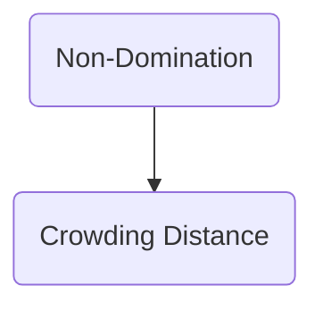

# Ideal Multi-Objective Optimizer
## What to do if we have multiple fitness Values?
>Need to fit multiple spec constriants and find the best optimal vector.
- A: We need to specify the optimal tradeOff curve in the solution space. It might be a multiple variables function.
- A: We must get additional info for us to find the optimal vector we are searching for.

# Pareto Domination.
> If both of the following conditions are true, then solution x dominates solution y
 1. Solution $x$ is no worse than $y$ in all objectves
 2. Solution $x$ is strictly better than $y$ in a least one objective.

# Pareto Front
 1. The Plot of Pareto-optimal set in objective space.
 2. in (Min,Max) are considered, we would produce 4 Pareto Optimal Fronts. With different optimal objectives.
 3. Finding the optimal tradeOff set on the pareto Front.

# Pareto Domination
 1. Dominated solutions are sub-optimal solutions.
 2. Non-dominated solutions are the Pareto Optimal Front

# Selection Non-Domination/Crowing Approach
1. Tournament selection of mating pool, first order sort using non-domination rank, if smae pareto front, determine using crowding distance.

2. Elitist truncation selection
